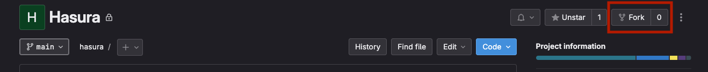

# Hasura

Access the main [documentation](https://docs.google.com/document/d/1Qbb4C3MDKAQKVZx9si0eXyFmscGT6ZFKaDb_jnP5oco/edit?pli=1 "documentation") for more information.

## Getting started

### Requirements

Before starting, make sure you have the following technologies installed on your local workstation:

- Docker
- [Hasura CLI](https://hasura.io/docs/latest/hasura-cli/install-hasura-cli/ "Hasura CLI")
- VSCode (optional)


### Project configuration

1. Fork hasura repository [here](https://gitlab.stratpoint.dev/capabilities/web/templates/protocols/hasura "Hasura Repository").
<br />


<br />

2. Clone the forked repository to your local machine.

```
$ git clone https://gitlab.stratpoint.dev/your-namespace/your-project-name
```

3. Copy the env.local.example in the frontend directory and create your own env file

```
NEXTAUTH_URL='http://localhost:3000'
NEXTAUTH_SECRET= <Generated Next Auth Secret >
AUTH_GITHUB_ID=<Github Client ID>
AUTH_GITHUB_SECRET=<Github Secret Key>
HASURA_PROJECT_ENDPOINT='http://host.docker.internal:8080/v1/graphql'

HASURA_ADMIN_SECRET=<Local Admin Secret>
```

- To generate the NEXTAUTH_SECRET, you may follow this [link](https://hasura.io/blog/next-js-jwt-authentication-with-next-auth-and-integration-with-hasura "Next Auth")
- AUTH_GITHUB_ID and AUTH_GITHUB_SECRET can be fetched by following the instructions [here](https://docs.github.com/en/apps/oauth-apps/building-oauth-apps/creating-an-oauth-app). 
   
4. Run the following command
```
docker compose up -d
```
5. Access the console
  ```
  hasura console --admin-secret <local_secret_admin_key>
  ```


## Folder Structure

```
├── .devcontainer
├── backend (in progress)
├── docs
│   ├── assets
├── frontend
│   ├── app
│   ├── components
│   ├── pages
│   │   └──api
├── metadata
│   ├── databases
│   │   └── default
├── migrations
│   └──  default
├── seeds
│   └──  default
├── prometheus
├── README.md
└── yarn.lock
```
